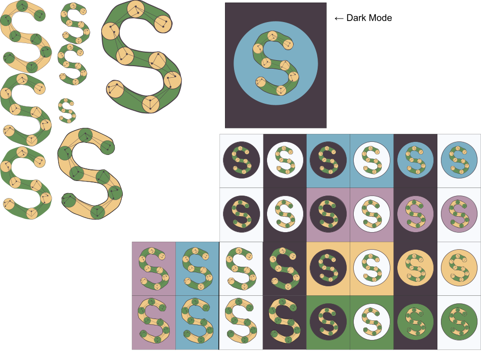

# Schmemory: Speech/Script Memorization

---

## Initial Project Concept
- An app that helps people memorize speeches and scripts.
- Speech Mode - Takes a bunch of text, splits by sentence, lets you view each sentence one-by-one.
- Script Mode - Takes a set of lines and prompts you with the cue lines
- Some form of progress bar, in the form of a time check. 
  - "I expect this speech/scene to take 5 minutes to read.”
- Potentially an auto-advance feature using voice recognition
  (forces people to read their script aloud, which helps you memorize better)

---

## Logo Design (by Sarah Todd)

*Logo Design*

  

*Icon Design*

---

## Demonstration Video

